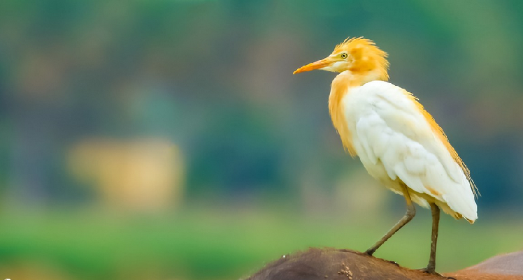

                             
**Apartado III**

 
Se presentan especies observadas en el campo

**Especie**: *Bubulcus ibis*,familia Ardeide (Orden Pelecaniformes)

**Descripción**: Mide  51  cm,pesa  350  grs. Los  adultos  son  blancos  con  iris,  pico  y  piel  de  la  cara  de  color  amarillo.  Las  patas  son negruzcas   y   la   coronilla,   espalda   y  pecho  teñidos  de ante (Luconi (2014),Stiles & Skutch, (2007)) En  plumaje reproductivo, las aves tienen un color ananjado hasta la corona, también el pecho y la espalda tambien con parches de plumas color beige (Stiles & Skutch, (2007), Kaufman, (2005) . Las patas varían de amarillo/rosa en la temporada reproductiva a grises/negras durante el invierno (Kaufman, 2005 )

**Distribución**: Esta de distribuye de los 1500m a los 7200m , es una especie que está distribuida mundialmente desde los trópicos hasta las zonas templadas (BirdLife International, 2016) .Es residente a lo largo de todo latinoamérica, es  residente y reproductor en todo USA, y en Honduras,Nicaragua, Panamá y Costa Rica (BirdLife International, 2016)

**Hábitat,alimentación y comportamiento**:Se  encuentran  en    sabanas,    pastizales,    manglares,  pantanos  y  áreas  agrícolas. Se  asocian con  el  Ganado, ahí asecha bichos como saltamomentes y otros insectos. Suelen forrajear en males de granja que pueden espantar insectos del pesto y suelen escoger árboles cerca del agua para anidar (Luconi, 2014). 

Estas tienen una asociación con el ganado ya que se asume que en los cuerpos del ganado hay invertebrados como moscas que forman gran parte de la dieta de la garza, y tal vez quita ectoparásitos del cuerpo del animal, además se ha observado que en su mayoría se alimentan de las patas delanteras (Heatwole, 1965)

El método general para cazar de *B.ibis* es caminar despacio dispersado con corridas hábiles dirigido hacia la presa ya observada, cuando el animal es localizado, es caputado por una corrida corta seguido a una puñalada. Las pequeñas son tragadas inmediatamente mientras que las más grandes como ranas o lagartijas son picoteadas a muerte. Oro de los comportamientos de caza es cuando observa a la presa, el ave extiende la cabeza y el cuello hacía adelante hasta que el cuerpo está casi horizontal, luego comienza a balancear la cabeza y el cuello de atrás para delante, hasta que el primer picoteo se consigue (Blaker, 1969).

Esta hace nidos en épocas diferentes a las demás especies de garzas, y en vegetación alta, pueden usar ramas de angle para construir sus nidos,aportando material nuevo durante  la incubación y cuando los pichones ya hayan nacido, además se estima que dura entre 3 y 11 días (Denis *et al*.,2003). 

{width=400px}

Figura 2. Adulto reproductivo de *Bubulcus ibis* fotografía tomada de Ebird

{width=400px}

Figura 3. Adulto  de *Bubulcus ibis* fotografía tomada de Ebird

