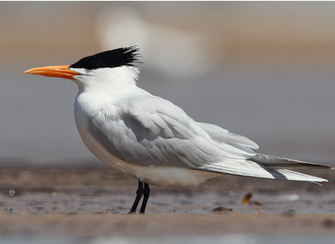

                             
**Apartado III**

 
Se presentan especies observadas en el campo

**Especie**: *Thalasseus maximus*, familia  Laridae (Orden 	Charadriiformes)

**Descripción**:Un individuo en estadío adulto llega a medir 48 cm y pesar 450g, siendo esta un ave grande. El pico es delgado y de un color anaranjado (fácil de ver en campo), y las patas son negras. Otra de las características a resaltar es que la parte posterior de la coronilla y la cresta nucal son  negras. Parte inferior del cuerpo (cabeza, cuello, abdomen, cola) es de color blanco y las alas son de un gris claro. Las primarias son más oscuras, y la cola es profundamente ahorquillada  (Stiles & Skutch, 2007).

**Distribución**: Esta es una especie migratoria que posee una amplia distribución, la reproducción la realiza desde el Suroeste y Este de Estados Unidos hasta el Norte de México, las Antillas, el Este de Suramérica hasta Uruguay. Por otra parte, invierna tanto en la costa pacífica como atlántica desde el Sur de Estados Unidos hasta Argentina; al Oeste de África y S de Europa (Stiles & Skutch, 2007). Pasada la época reproductiva, los individuos se dispersan a lo largo de las costas  tropicales y subtropicales (Buckley & Buckley, 2002).

**Hábitat,alimentación y comportamiento**: Su comportamiento a la hora de alimentarse, se caracteriza por, pescar en pequeños grupos o de forma solitaria en las costas, bahías de sal, estuarios; sobretodo en aguas poco profundas. También posee la habilidad de zambullirse desde el vuelo para atrapar peces pequeños, en ocasiones mientras va volando roza el agua con el pico. Además, de robar la comida de otras aves (Stiles & Skutch, 2007; Audubon Online). 

Esta especie realiza bailes de cortejo en donde dos o más individuos vuelan en espiral o sino el macho en tierra firme le ofrece comida a la hembra, estos se inclinan y se contornean en círculos. El nido es construido en el suelo por ambos padres, y estos alimentan a sus crías, las cuales, son reconocidas por los sonido que realizan. Estas pertenecen hasta 8 meses con sus padres para finalmente migrar con ellos. El cuidado parental se da en colonias de crías y la primera reproducción se presenta de forma tardía. Son una especie altamente social (Neotropical Birds Online; Audubon Online)

{width=400px} 

Figura 4.  Características corporales de un adulto de *Thalasseus maximus* en estado reproductivo.

{width=400px} 

Figura 5.  *Thalasseus maximus* en vuelo, observar las características de las primarias y la cola.

